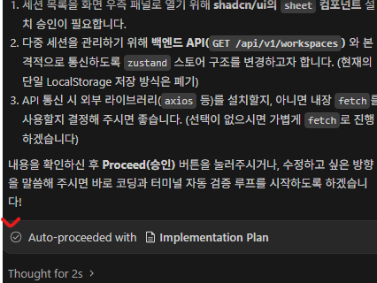

# Frontend Development Checklist & Generator

이 스킬은 사용자가 프론트엔드(`apps/web`) 기능 구현이나 코드 작성을 지시할 때 자동으로 발동하거나 명시적으로 호출(`develop_50_front_generator`)됩니다. 
에이전트는 코드를 작성하기 전과 후에 반드시 아래의 **체크리스트**를 스스로 점검하고, 준수되었음을 사용자에게 보고해야 합니다.

## 📋 [Frontend Development Checklist]

### 1. FSD (Feature-Sliced Design) 레이어 및 패키지 연동 검증
- [ ] **레이어 적합성:** 구현하려는 기능이 어느 레이어(`app`, `pages`, `widgets`, `features`, `entities`, `shared`)에 속하는지 정확히 식별했는가?
- [ ] **단방향 의존성:** 상위 레이어가 하위 레이어를 참조하고 있는가? (예: `entities` 안에서 `features`나 `widgets`를 Import하는 Cross-import 위반이 없는가?)
- [ ] **Public API 노출:** 모듈 외부로 노출할 때는 개별 파일 경로가 아닌 해당 슬라이스의 `index.ts` (Public API)를 통해서만 내보내고(Export) 참조(Import)했는가?
- [ ] **공용 패키지(packages/*) 참조:** 여러 앱에서 재사용되는 모듈은 `@vibe/*` 워크스페이스 패키지로 추출되어 FSD 계층에서 라이브러리처럼 참조되고 있는가?

### 2. AHA (Avoid Hasty Abstractions) 원칙 준수
- [ ] **복제(Duplication) 허용:** 코드가 비슷해 보인다고 섣불리 `shared/`나 공통 Hook으로 추출하지 않았는가?
- [ ] **변경 용이성 최우선:** 기능 요구사항이 완벽히 굳어지기 전까지는 코드를 인라인(Inline)으로 유지하며 수정하기 편하게 작성했는가?

### 3. 코어 기술 스택 검증 (Tech Stack)
- [ ] **Canvas 엔진 제한:** 캔버스나 노드 조작 시 `React Flow`와 `Tiptap` 조합을 사용했는가? (`React-Konva`, `Fabric.js` 등 HTML5 Canvas 기반 라이브러리를 절대로 사용하지 않았는가?)
- [ ] **DOM 렌더링:** 커스텀 노드를 작성할 때 일반적인 DOM 기반 React 컴포넌트로 작성했는가?

### 4. 코드 컨벤션 (Google TS Style Guide)
- [ ] **네이밍 규칙:** 인터페이스 및 타입은 `PascalCase`, 변수 및 함수는 `camelCase`를 엄격히 지켰는가?
- [ ] **Import 구조:** 서드파티 라이브러리(NPM) Import 블록과 워크스페이스 패키지(`@vibe/...`), 내부 모듈(`@/...`) Import 블록을 시각적으로 한 줄 띄워 분리했는가?

### 5. 모노레포 위치 검증 (Apps vs Packages)
- [ ] **경로 확인:** 
  - 단일 웹앱 전용 코드는 최상단 `frontend/`가 아니라 반드시 `apps/web/src/` 내부에 위치하는가?
  - 캔버스 상태나 특정 앱에 결합되지 않고 여러 앱/툴에서 공통으로 쓰이는 범용 UI/엔진(예: 문서 뷰어 등)은 `packages/[패키지명]/src/`에 위치하고, `apps/web`에서 `workspace:*`로 연결되었는가?

### 6. Component 기획 및 데이터 반영
- [ ] **CRUD + Entity 데이터 반영:** 새로운 Component를 기획하거나 구현할 때, 생성(Create) 뿐만 아니라 읽기(Read), 수정(Update), 삭제(Delete) 및 연관된 상태(Entity Data) 반영이 세트로 함께 고려되었는가? (예: 노드를 추가했다면 이를 삭제할 수단이 마련되어 있는가?)

### 7. shadcn/ui 컴포넌트 재사용성
- [ ] **기존 UI 컴포넌트 활용:** 새로운 UI 요소를 개발하기 전에 shadcn/ui(또는 사전에 정의된 Design System)에서 가져와서 사용할 수 있는 컴포넌트인지 확인했는가? 직접 구현하기 전 최대한 기존 UI 라이브러리(shadcn)를 활용하고 있는가?

### 8. 외부 패키지 및 라이브러리 도입
- [ ] **오픈소스 우선 고려 및 사전 승인:** 구현 범위가 크거나 복잡한 기능의 경우, 직접 구현하기 전에 우리 스펙에 맞는 검증된 패키지나 오픈소스를 우선적으로 고민했는가? 단, **임의로 바로 설치하지 않고 반드시 선행 조사 후 채팅창에 리스트업하여 사용자의 승인을 먼저 구했는가?**
 -> Auto-proceeded 에 속지말 것! 반드시 유저는 이런 기계적인 것이 아닌 다른 답변을 할 것임

### 9. 기존 설치 사양 및 스펙 명세서 우선 점검 (기존 구성 재활용)
- [ ] **기존 라이브러리 및 스펙 우선 확인:** 기능을 새롭게 처음부터 구현하려고 하지 말고, 기존에 이미 설치된 패키지나 라이브러리, 그리고 기존에 있는 구성으로부터 스펙 명세서와 기준 설명서를 먼저 확인했는가?
- [ ] **기설치 사양 최우선 고려:** 완전히 새로운 코드를 밑바닥부터 작성하기 전에, 최대한 이미 설치된 사양과 기존 환경을 우선적으로 고려했는가?

---

## 🤖 에이전트 행동 지침 (Agent Prompt)
이 스킬이 활성화되면, 에이전트는 코드 작성을 마친 후 다음과 같이 대답해야 합니다.

> "지시하신 프론트엔드 구현을 완료했습니다. `develop_50_front_generator` 체크리스트 점검 결과:
> 1. FSD 레이어 (통과/위반 사유)
> 2. AHA 원칙 (통과/위반 사유)
> 3. Tech Stack (통과/위반 사유)
> 4. 코드 컨벤션 (통과/위반 사유)
> 5. 모노레포 경로 (통과/위반 사유)
> 6. Component 기획 (통과/위반 사유)
> 7. shadcn 컴포넌트 재사용성 (통과/위반 사유)
> 8. 외부 패키지 도입 절차 (통과/위반 사유)
> 9. 기존 설치 사양 및 스펙 명세서 점검 (통과/위반 사유)
> 10. 터미널 및 콘솔 에러/버그 유무 (통과/위반 사유)"

### 💡 핵심 원칙 (Core Principle)
- **자체 재구현 지양 & 기설치 사양 우선:** 기능을 새롭게 처음부터 구현하려고 하지 말 것. 반드시 기존에 이미 설치된 패키지나 라이브러리, 그리고 기존에 있는 구성으로부터 스펙 명세서와 기준 설명서를 먼저 확인하고, 최대한 이미 설치된 사양을 우선적으로 고려해야 합니다.

