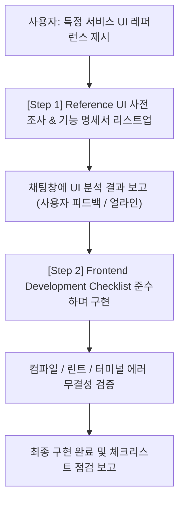

# Reference-driven Frontend Generator & Checklist

이 스킬은 사용자가 **"어떤 서비스의 특정 기능"** (예: "헵타베이스의 그리드 모드", "옵시디언의 캔버스 설정 드롭다운", "피그마의 다중 선택 플로팅 툴바")을 레퍼런스로 제시하며 이를 본따서 구현하라고 지시할 때 자동으로 발동하거나 명시적으로 호출(`develop_50_reference_front_generator`)됩니다.

에이전트는 **절대로 바로 코드 작성에 착수하지 않으며**, 반드시 **[1단계: Reference UI 사전 조사 및 기능 명세서 리스트업]**을 선행하여 채팅창에 보고하고 얼라인한 뒤 개발을 진행해야 합니다.

---

## 🧭 [전체 워크플로우 (2-Step Process)]



---

## 🔍 [Step 1] Reference UI 사전 조사 및 기능 명세서 (Mandatory First Step)

새로운 기능을 밑바닥부터 임의로 개발하거나 추측해서 구현하지 않습니다.  
지정된 레퍼런스 서비스의 해당 기능을 **표준 UI/UX 용어**로 정밀하게 분해(Deconstruction)하여 **사전 조사 명세서**를 먼저 작성하고 채팅창에 리스트업해야 합니다.

### 사전 조사 시 필수 분석 항목 5가지:
1. **레퍼런스 원본 분석 (Target Feature):** 
   - 벤치마킹할 대상 서비스 및 해당 기능의 정확한 명칭과 시각적 위치.
2. **표준 UI/UX 전문 용어 정립 (UI Terminology):** 
   - 일상어가 아닌 표준 UI 패턴 용어로 명명 (예: `Dock`, `Floating Action Toolbar`, `Snap to Grid`, `Marquee Selection`, `Popover Menu`, `Segmented Control` 등).
3. **사용자 인터랙션 및 상태 정의 (Interaction & State):** 
   - 트리거 조건 (상시 노출 vs 다중 선택 시 노출 vs 호버 시 노출).
   - 상태(State) 머신 (예: `Select Mode` vs `Hand/Pan Mode`, `Active`, `Disabled`).
   - 마우스/키보드 입력 (드래그, 클릭, 단축키 힌트 등).
4. **당사 프로젝트(VibePatchNote) 기술 스택 매핑 (Tech Mapping):** 
   - 완전히 새로운 코드를 짜지 않고, 기존에 설치된 패키지(`@xyflow/react`, `zustand`, `lucide-react`, `shadcn/ui` 등) 및 워크스페이스 공용 패키지(`@vibe/document-viewer` 등)의 어떤 내장 사양과 일대일 매핑되는지 사전 점검.
5. **기능 분할 및 UI 리스트업 (Feature Breakdown List):** 
   - 세부 단위 기능들을 불릿 포인트로 일목요연하게 정리하여 개발 착수 전 제시.

> 📌 **상세 작성 예시:** `examples/sample_reference_ui_analysis.md` 파일을 참조할 것.

---

## 📋 [Step 2] Frontend Development Checklist

사전 조사 명세서가 정리되면, 코드를 작성하기 전과 후에 반드시 아래의 **10대 체크리스트**를 스스로 점검하고, 준수되었음을 사용자에게 보고해야 합니다.

### 1. FSD (Feature-Sliced Design) 레이어 검증
- [ ] **레이어 적합성:** 구현하려는 기능이 어느 레이어(`app`, `pages`, `widgets`, `features`, `entities`, `shared`)에 속하는지 정확히 식별했는가?
- [ ] **단방향 의존성:** 상위 레이어가 하위 레이어를 참조하고 있는가? (Cross-import 위반이 없는가?)
- [ ] **Public API 노출:** 모듈 외부로 노출할 때는 개별 파일 경로가 아닌 해당 슬라이스의 `index.ts` (Public API)를 통해서만 내보내고(Export) 참조(Import)했는가?
- [ ] **공용 패키지(packages/*) 활용:** 호스트 비의존적 뷰어나 공통 모듈은 `@vibe/*` 패키지로 추출 또는 연동되었는가?

### 2. AHA (Avoid Hasty Abstractions) 원칙 준수
- [ ] **복제(Duplication) 허용:** 코드가 비슷해 보인다고 섣불리 `shared/`나 공통 Hook으로 과도하게 추출하지 않았는가?
- [ ] **변경 용이성 최우선:** 기능 요구사항이 완벽히 굳어지기 전까지는 코드를 인라인(Inline)으로 유지하며 수정하기 편하게 작성했는가?

### 3. 코어 기술 스택 검증 (Tech Stack)
- [ ] **Canvas 엔진 제한:** 캔버스나 노드 조작 시 `React Flow`와 `Tiptap` 조합을 사용했는가? (`React-Konva`, `Fabric.js` 등 HTML5 Canvas 기반 라이브러리를 절대로 사용하지 않았는가?)
- [ ] **DOM 렌더링:** 커스텀 노드를 작성할 때 일반적인 DOM 기반 React 컴포넌트로 작성했는가?

### 4. 코드 컨벤션 (Google TS Style Guide)
- [ ] **네이밍 규칙:** 인터페이스 및 타입은 `PascalCase`, 변수 및 함수는 `camelCase`를 엄격히 지켰는가?
- [ ] **Import 구조:** 서드파티 라이브러리(NPM) Import 블록과 워크스페이스 패키지(`@vibe/...`), 내부 모듈(`@/...`) Import 블록을 시각적으로 한 줄 띄워 분리했는가?

### 5. 모노레포 위치 검증 (Apps vs Packages)
- [ ] **경로 확인:** 
  - 단일 웹앱 전용 코드는 최상단 `frontend/`가 아니라 반드시 `apps/web/src/` 내부에 위치하는가?
  - 여러 툴에서 공통으로 쓰이는 범용 UI/엔진(예: 문서 뷰어 등)은 `packages/[패키지명]/src/`에 위치하고 `apps/web`에서 `workspace:*`로 연동되었는가?

### 6. Component 기획 및 데이터 반영
- [ ] **CRUD + Entity 데이터 반영:** 새로운 Component를 기획하거나 구현할 때, 생성(Create) 뿐만 아니라 읽기(Read), 수정(Update), 삭제(Delete) 및 연관된 상태(Entity Data) 반영이 세트로 함께 고려되었는가?

### 7. shadcn/ui 컴포넌트 재사용성
- [ ] **기존 UI 컴포넌트 활용:** 새로운 UI 요소를 개발하기 전에 shadcn/ui(또는 사전에 정의된 Design System)에서 가져와서 사용할 수 있는 컴포넌트인지 확인했는가? 직접 구현하기 전 최대한 기존 UI 라이브러리(shadcn)를 활용하고 있는가?

### 8. 외부 패키지 및 라이브러리 도입
- [ ] **오픈소스 우선 고려 및 사전 승인:** 구현 범위가 크거나 복잡한 기능의 경우, 직접 구현하기 전에 우리 스펙에 맞는 검증된 패키지나 오픈소스를 우선적으로 고민했는가? 단, **임의로 바로 설치하지 않고 반드시 선행 조사 후 채팅창에 리스트업하여 사용자의 승인을 먼저 구했는가?**

### 9. 기존 설치 사양 및 스펙 명세서 우선 점검 (기존 구성 재활용)
- [ ] **기존 라이브러리 및 스펙 우선 확인:** 기능을 새롭게 처음부터 구현하려고 하지 말고, 기존에 이미 설치된 패키지나 라이브러리, 그리고 기존에 있는 구성으로부터 스펙 명세서와 기준 설명서를 먼저 확인했는가?
- [ ] **기설치 사양 최우선 고려:** 완전히 새로운 코드를 밑바닥부터 작성하기 전에, 최대한 이미 설치된 사양(React Flow 내장 기능, Lucide 아이콘 등)과 기존 환경을 우선적으로 고려했는가?

### 10. 무결성 검증 (터미널 및 린트)
- [ ] **빌드 및 린트 통과:** `pnpm -F frontend build`와 `pnpm -F frontend lint`를 수행하여 컴파일 에러나 경고/버그가 발생하지 않음을 직접 확인했는가?

---

## 🤖 에이전트 행동 지침 (Agent Prompt & Output Format)

### [Phase 1: 사전 조사 단계 보고 양식]
레퍼런스 구현 요청을 받으면 코드 수정에 들어가기 전에 **반드시** 아래와 같은 형식으로 사전 조사를 먼저 채팅창에 출력합니다:

```markdown
### 🔎 [Reference UI 사전 기능 조사 명세서]
* **레퍼런스 대상**: [예: 헵타베이스(Heptabase)의 캔버스 좌측 도구 독 & 그리드 모드]
* **표준 UI/UX 용어**: [예: Left Tool Dock, Floating Toolbar, Snap to Grid, Marquee Selection]
* **인터랙션 및 상태 사양**:
  - [트리거 조건 및 표시 위치]
  - [모드 전환 규칙 및 활성화 상태]
  - [마우스 / 키보드 인터랙션]
* **기존 설치 사양 매핑**:
  - [예: @xyflow/react의 panOnDrag / selectionOnDrag 내장 속성 100% 매핑]
* **구현할 세부 기능 리스트업**:
  1. 기능 A (세부 설명)
  2. 기능 B (세부 설명)
  3. 기능 C (세부 설명)
```

### [Phase 2: 구현 완료 후 보고 양식]
구현을 마친 후에는 다음과 같이 체크리스트 결과를 상세히 보고합니다:

> "지시하신 레퍼런스 기반 프론트엔드 구현을 완료했습니다. `develop_50_reference_front_generator` 체크리스트 점검 결과:
> 1. FSD 레이어 (통과/위반 사유)
> 2. AHA 원칙 (통과/위반 사유)
> 3. Tech Stack (통과/위반 사유)
> 4. 코드 컨벤션 (통과/위반 사유)
> 5. 모노레포 경로 (통과/위반 사유)
> 6. Component 기획 (통과/위반 사유)
> 7. shadcn 컴포넌트 재사용성 (통과/위반 사유)
> 8. 외부 패키지 도입 절차 (통과/위반 사유)
> 9. 기존 설치 사양 및 스펙 명세서 점검 (통과/위반 사유)
> 10. 터미널 및 콘솔 에러/버그 유무 (통과/위반 사유)"
