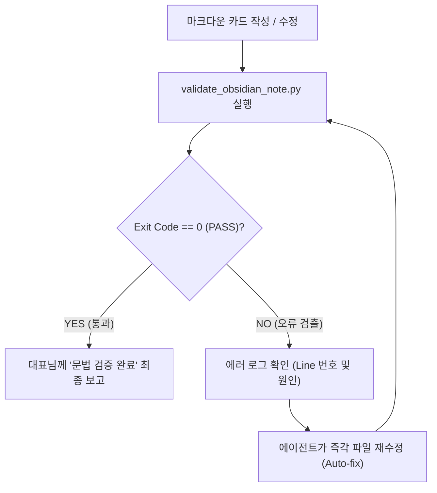

# 🛡️ External PM Obsidian Syntax Linter (`What-s-in-my-head` 전용)

이 스킬은 외부 프로젝트 관리 볼트(`What-s-in-my-head`) 내에 마크다운 카드를 생성하거나 수정한 후, **옵시디언 데스크톱(Electron) 앱에서 프론트매터 파싱 크래시(빨간 에러 박스)가 일체 발생하지 않도록 기본 문법 결함을 기계적으로 신속 검증**하는 초경량 린터 워크플로우입니다.

---

## 🎯 1. 발동 시점 (Triggers)

다음 상황에서 코딩 에이전트는 완료 보고를 하기 전에 본 스킬을 실행합니다:
1. `What-s-in-my-head` 볼트 내 마크다운 노트를 신규 생성하거나 수정한 직후
2. 사용자가 "옵시디언 문법 체크해줘", "프론트매터 깨진 거 확인해", "YAML 에러 점검해"라고 지시할 때

---

## 🔍 2. 핵심 린팅 항목 (The Core Linter Checks)

검증 도구(`.agents/tools/obsidian/validator/validate_obsidian_note.py`)는 옵시디언 Electron 렌더링을 깨뜨리는 핵심 결함만 선별 검사합니다:

| 린팅 항목 | 실패 조건 (Fail Criteria) | 교정 행동 (Self-Healing Action) |
| :--- | :--- | :--- |
| **1. 비따옴표 콜론 공백** | 값 내부에 큰따옴표 없이 `: `(콜론 뒤 공백)이 포함되어 키 매핑 오류를 유발할 때 | `요약:` 등 문자열 전체를 큰따옴표(`"..."`)로 감싸고 내부 콜론을 대시(`—`)로 치환 |
| **2. 줄끝 LF 검사 (CRLF 오염)** | 윈도우 환경에서 `\r\n`(CRLF)이 검출될 때 (속성창 경계선 인식 오류) | 줄바꿈을 `\n`(LF)으로 정규화하여 `newline=""` 옵션으로 재저장 |
| **3. YAML 기본 구문 검증** | `yaml.safe_load` 시 SyntaxError(들여쓰기, 괄호 등) 발생 시 | 들여쓰기 2칸 정렬 및 따옴표 닫힘 교정 |
| **4. 리스트 위키링크 안전성** | `- [[이름]]` 형태로 따옴표 없이 작성되어 중첩 리스트로 오인될 때 | 반드시 `- "[[이름]]"` 형태로 큰따옴표 감싸기 |
| **5. multitext 속성 타입 검증 (숫자·날짜 float 방지)** | `분류`, `주제` 등 문자열 리스트에 `- 09.30`, `- 26.09.29` 처럼 따옴표 없는 마침표 숫자가 들어가 `float`(9.3)로 자동 캐스팅되어 속성창 경고(⚠️) 유발 시 | 반드시 큰따옴표로 감싸 문자열(`- "09.30"`, `- "26.09.29"`)로 작성 |
| **6. 경로 기반 프로젝트 단일 분류 검증 (Single Class Policy)** | `1.project` 구역에서 최상위 1레벨 프로젝트 폴더명 외에 하위 서브폴더명(`decisions`, `26.09.29`, `prototypes` 등)이 리스트로 다중 침범했을 때 | 최상위 1레벨 프로젝트 관리 폴더명 단 하나만 남기고 하위 폴더명 일체 제거 |
| **7. 결정 카드 상태 무결성 (`DEC-STAT-001`)** | `discussions/*/decisions/` 경로의 결정 카드가 `상태: 결정 사항`이 아닐 때 | 상태를 `결정 사항`으로 통일 |
| **8. 원 정리본 데이터 혈통 추적 (`DEC-LNK-001`)** | `Decision N` 카드의 프론트매터 `링크:`에 해당 날짜의 `A5.outputs/D{N}_*.md` 원본 위키링크가 누락되었을 때 | 원천 회의록/공유회 아웃풋의 `[[D{N}_...]]` 위키링크를 필수 바인딩 |
| **9. 볼트 그라운드 룰: 버그 칩 무결성 (`SYS-BUG-001`)** | `🐛 버그 리포트` 구역 카드의 `작성자` 속성에 `[[bug]]` 칩이 누락되었을 때 | 칸반 보드 식별을 위해 `작성자` 목록에 `[[bug]]`를 반드시 유지·추가 |
| **10. 상태값의 분류 속성 침범 방지 (`CLS-STATUS-LEAK-001`)** | `검토 중`, `진행 중`, `완료`, `보류` 등 `상태` 속성 고유값이 `분류` 리스트에 오염·침범했을 때 | `분류` 속성에서 해당 상태값을 즉시 제거하여 속성 간 관심사 분리 |
| **11. 리소스 구역 1레벨 단일 분류 검증 (`CLS-RESOURCE-SINGLE-001`)** | `3.resource` 구역 노트의 `분류`에 최상위 1레벨 관리 폴더명(`SM_Spec_Discoverying` 등) 외에 서브폴더나 다중 항목이 침범했을 때 | 최상위 1레벨 폴더명 단 하나만 남기고 일체 제거 (Single Classification Policy) |

---

## 💻 3. 표준 실행 프로토콜 (Agent Execution Guide)

에이전트는 파일을 수정하거나 작성한 후, `run_command` 도구를 사용하여 본 검증 도구를 즉시 실행합니다.

### ① 단일 파일 검증 (Single Note)
```bash
python .agents/tools/obsidian/validator/validate_obsidian_note.py "c:\망고독 관련 자료\프로젝트_매니지먼트\What-s-in-my-head\3.📦(Resource) 자료\R&D 프로젝트 매니징\SVPG_Discoverying_실전적용\hypothesis\risks\(gen)서브리스크 카드 01 — Demand Risk (수요 절박성).md"
```

### ② 특정 폴더 전체 일괄 검증 (Batch Directory)
```bash
python .agents/tools/obsidian/validator/validate_obsidian_note.py --dir "c:\망고독 관련 자료\프로젝트_매니지먼트\What-s-in-my-head\3.📦(Resource) 자료\R&D 프로젝트 매니징\SVPG_Discoverying_실전적용\hypothesis\risks"
```

---

## 🔄 4. 자가 수복 루프 (Self-Healing Loop)



1. 스크립트 실행 후 종료 코드가 `1`이면(에러 검출):
   * 콘솔에 출력된 `[FAIL] 파일명 -> Line X: 원인` 로그를 확인합니다.
   * 대표님께 질문하거나 보고하기 전에, **에이전트 스스로 해당 라인을 수정(`replace_file_content`)**합니다.
2. 스크립트 재실행 후 `[PASS]` 및 `결과: 전수 통과!`가 출력될 때에만 사용자에게 보고합니다.
