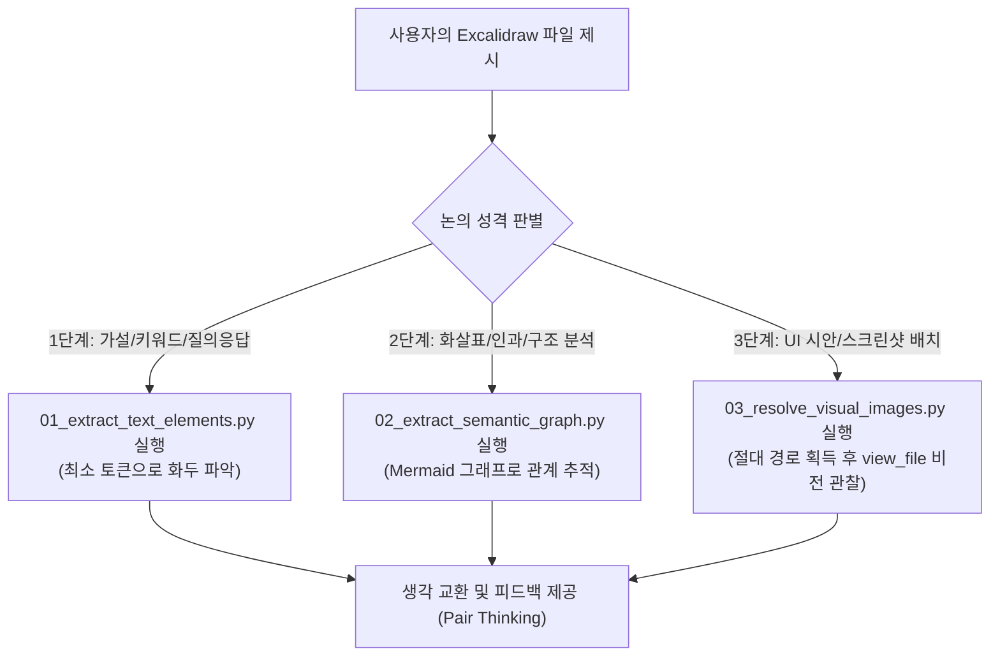

# 🎨 External PM Obsidian Excalidraw Collaborator (시각적 캔버스 페어 싱킹)

이 스킬은 사용자가 Obsidian Excalidraw 파일(`(Draw)...md`)을 공유하며 **"같은 화면을 보며 생각을 주고받자"**고 요청할 때, **토큰 낭비를 원천 차단하면서 사용자의 시각적 의도와 구조적 위상(Topology)을 완벽하게 동기화하여 고밀도 페어 싱킹(Pair Thinking)을 수행하는 전문 스킬**입니다.

---

## 🎯 1. 발동 시점 (Triggers)

다음 상황에서 코딩 에이전트는 본 스킬을 우선 발동합니다:
1. 사용자가 `(Draw)...md` 또는 Excalidraw 마크다운 파일을 `@`로 멘션하며 분석이나 논의를 요청할 때
2. "이 Excalidraw 파일 보고 같이 고민해보자", "캔버스 다이어그램 같이 보면서 이야기하자"고 할 때
3. 캔버스 도면 내의 아키텍처 흐름, 데이터 바인딩, 작업 기준선, 사용자 의사결정(Decision)에 대해 질의응답 및 브레인스토밍을 지시할 때

---

## 🛠️ 2. 보유 도구 자산 (`.agents/tools/obsidian/excalidraw`)

에이전트는 캔버스 원본의 수만 토큰짜리 렌더링 노이즈를 직접 읽지 않고, 아래의 전용 도구를 `run_command`로 실행하여 정보를 선별 획득합니다:

| 도구 스크립트 | 역할 및 특성 | 토큰 소모 | 주 사용 국면 |
| :--- | :--- | :--- | :--- |
| **`01_extract_text_elements.py`** | 마크다운 상단의 `## Text Elements`와 `## Embedded Files`만 즉시 슬라이싱 | **200~300 토큰** | 화두, 의문점, 대립쌍(VS), 키워드 중심 빠른 아이데이션 |
| **`02_extract_semantic_graph.py`** | 드로잉 JSON 해독 및 노이즈 100% 제거 후 **Mermaid 다이어그램** 생성 | **800~1,200 토큰** (96% 절감) | "무엇이 어디로 연결되는가?", 인과 관계, 아키텍처 구조 분석 |
| **`03_resolve_visual_images.py`** | 캔버스 내보내기 PNG 및 삽입된 스크린샷(`Pasted Image...`)의 로컬 절대 경로 탐색 | **0 토큰** (경로 안내) | 사용자가 짚은 UI 지점이나 캔버스 전체 화면을 `view_file`로 비전 관찰 |

---

## 📋 3. 3단계 페어 싱킹 프로토콜 (The 3-Tier Protocol)

에이전트는 사용자의 질문 깊이와 맥락에 따라 다음 단계를 유연하게 밟습니다:



### [Step 1] 화두 및 핵심 의문 파악 (Fast Ideation)
```bash
python .agents/tools/obsidian/excalidraw/01_extract_text_elements.py "<Excalidraw파일경로>"
```
- 사용자가 적어둔 질문 리스트, `VS` 대립쌍, 참조 문서 링크(`[[Decision ...]]`)를 즉각 수집합니다.
- 토큰 소모가 극소량이므로, 가장 먼저 가볍게 맥락을 잡을 때 필수적으로 실행합니다.

### [Step 2] 논리적 위상 및 연결 관계 파악 (Deep Topology)
```bash
python .agents/tools/obsidian/excalidraw/02_extract_semantic_graph.py "<Excalidraw파일경로>"
```
- "A 작업에서 B로 어떻게 이어지는가?", "포인터 마커가 어느 스크린샷을 가리키는가?" 등 연결 관계가 중요할 때 실행합니다.
- 원본 10만 바이트의 JSON을 읽지 않고, 산출된 간결한 Mermaid 코드를 바탕으로 인과 관계를 추론합니다.

### [Step 3] 시각적 뷰 싱크 (Visual Multimodal Sync)
```bash
python .agents/tools/obsidian/excalidraw/03_resolve_visual_images.py "<Excalidraw파일경로>"
```
- 도구의 출력에서 발견된 실제 스크린샷 이미지 경로를 `view_file` 도구로 호출합니다.
- Gemini 멀티모달 비전을 통해 사용자가 스크린샷 위에 표시한 위치, UI 구성 요소, 레이아웃을 인간과 동일한 시각으로 직관 확인합니다.

---

## 🧠 4. 페어 싱킹 가이드라인 (Pair Thinking Guardrails)

1. **무지성 파일 전체 읽기 절대 금지 (Token Blast Prevention)**:
   - Excalidraw 마크다운의 `## Drawing` 이하 수만 줄을 `view_file`로 통째로 읽어서는 안 됩니다. 반드시 `.agents/tools/obsidian/excalidraw/`의 전용 도구를 통합니다.
2. **VS 대립쌍과 트레이드오프 집중 분석**:
   - 캔버스에 표현된 `VS` (예: *1:1 타이트 매핑 vs 느슨한 참조 뼈대*)는 사용자가 가장 깊게 고민하고 있는 의사결정 분기점입니다. 각 선택지의 득과 실(Trade-offs)을 명확히 대조하여 의견을 제시합니다.
3. **도메인 정체성 엄격 준수**:
   - 본 프로젝트(`MangoDoc` / `VibePatchNote`)는 **범용 문서 빌더/스캐폴딩 엔진, 리치 텍스트·캔버스 시각화, 도메인 중립 Agent 런타임 시스템**입니다.
   - 소설, 웹소설, 시나리오 등의 특정 창작 용어나 비유는 일체 사용하지 않습니다.
4. **사족 없는 본질 중심 답변**:
   - 뻔한 맞장구나 일반론은 배제하고, "사용자의 작업 기준선이 흔들리지 않으려면 무엇이 필요한가?", "이 인지 부담을 덜어주기 위해 어떤 데이터 구조가 적합한가?"에 초점을 맞춰 날카롭고 실질적인 통찰을 나눕니다.
