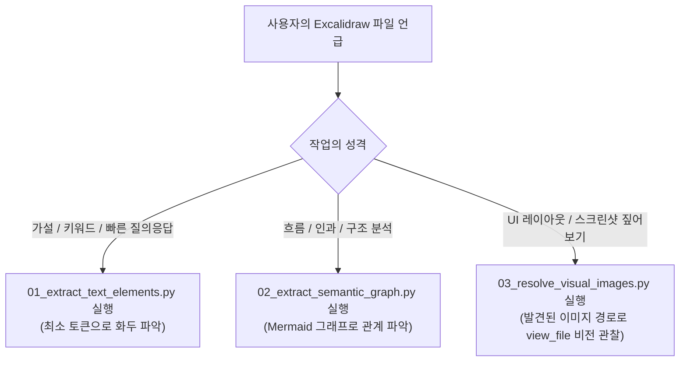

# 🎨 Tools Obsidian Excalidraw (`.agents/tools/obsidian/excalidraw`)

이 도구 모음은 **Obsidian Excalidraw 마크다운 도면(`.md`)을 AI 에이전트가 토큰 낭비 없이 완벽하게 읽고, 사용자와 같은 시각적 맥락을 공유하며 페어 싱킹(Pair Thinking)을 수행할 수 있도록 설계된 전문 도구 세트**입니다.

---

## 🏷️ 네이밍 룰 및 도구 역할 정의 (Naming Rules & Roles)

도구는 **단계별 정보 추출 깊이와 실행 순서**에 따라 `01_`, `02_`, `03_`의 정렬된 접두사를 따릅니다:

| 스크립트 명 | 역할 및 목적 | 토큰 소모 | 언제 사용하는가? |
| :--- | :--- | :--- | :--- |
| **`01_extract_text_elements.py`** | **[텍스트 슬라이서]**<br/>하단의 무거운 드로잉을 일체 건너뛰고, 상단의 `## Text Elements`와 `## Embedded Files`만 즉시 추출 | **200 ~ 300 토큰**<br/>(제로 오버헤드) | 캔버스에 적힌 아이디어, 질문, 대립쌍(VS), 키워드를 바탕으로 **빠르게 브레인스토밍**할 때 |
| **`02_extract_semantic_graph.py`** | **[시맨틱 그래프 변환기]**<br/>드로잉 JSON을 해독하여 좌표/스타일 등 수만 토큰의 렌더링 노이즈를 100% 제거하고, 노드와 화살표(Arrow) 연결선만 추출해 **Mermaid 다이어그램**으로 압축 | **800 ~ 1,200 토큰**<br/>(96% 이상 절감) | "무엇이 어디로 연결되는지", 인과 관계, 아키텍처 흐름, **논리적 구조를 깊이 있게 파악**할 때 |
| **`03_resolve_visual_images.py`** | **[비전 자산 로케이터]**<br/>캔버스에 연동된 내보내기 이미지(`.png`/`.svg`) 및 캔버스 내부에 붙여넣은 스크린샷(`[[Pasted Image ...]]`)의 로컬 절대 경로를 해결 | **0 토큰**<br/>(경로 안내 후 view_file로 비전 입력) | 사용자가 표시한 빨간 마커나 **UI 시안, 실제 화면 배치를 비전(Vision)으로 직접 확인**할 때 |

---

## 🚀 빠른 실행 가이드 (Quick CLI Usage)

모든 도구는 대상 Excalidraw 파일의 경로(상대 경로 또는 절대 경로)를 인자로 받습니다.

### 1. 텍스트 요소만 초고속 추출
```bash
python .agents/tools/obsidian/excalidraw/01_extract_text_elements.py "<파일경로>"
# JSON 포맷으로 받기:
python .agents/tools/obsidian/excalidraw/01_extract_text_elements.py "<파일경로>" --json
```

### 2. 시맨틱 그래프(Mermaid)로 압축 추출
```bash
python .agents/tools/obsidian/excalidraw/02_extract_semantic_graph.py "<파일경로>"
# 노드 라벨 글자 수 제한 조절:
python .agents/tools/obsidian/excalidraw/02_extract_semantic_graph.py "<파일경로>" --max-len 30
```

### 3. 연동된 시각 이미지 절대 경로 찾기
```bash
python .agents/tools/obsidian/excalidraw/03_resolve_visual_images.py "<파일경로>"
```

---

## 🤖 에이전트 판단 결정표 (Agent Decision Table)

사용자가 "Excalidraw 도면 보고 같이 생각해보자"고 요청할 때 에이전트는 아래 순서로 행동합니다:


